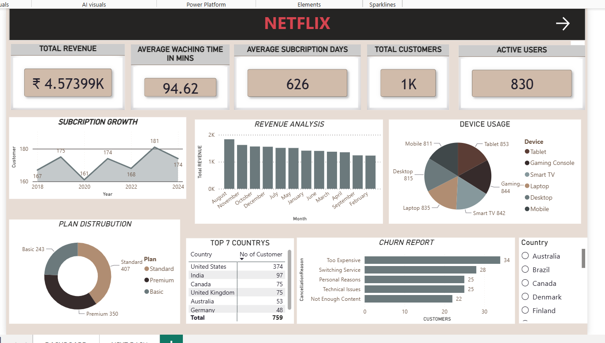
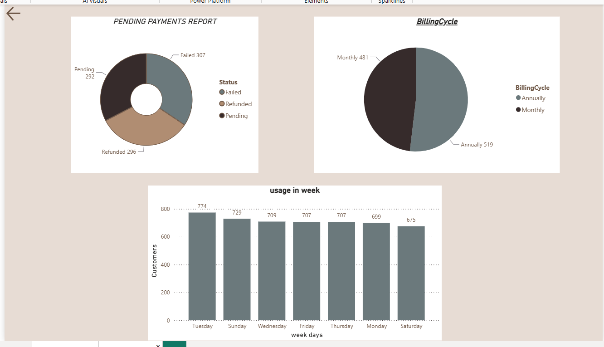

# Power BI Sales Dashboard

## Project Overview
This dashboard analyzes sales performance, customer behavior, and product trends.

## Tools Used
- Power BI
- Power Query
- DAX
- Excel

## Key Insights
- Top performing products
- Monthly sales trends
- Regional performance analysis
- Customer segmentation

## Dashboard Preview

### Dashboard 1

### Dashboard 2

## Author
Sahil Dada
